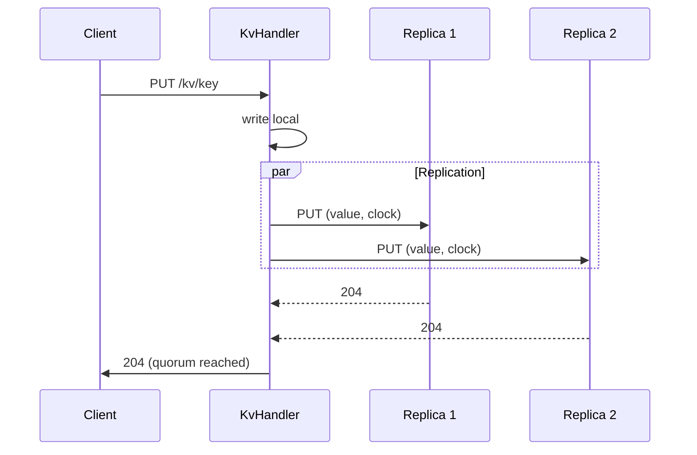
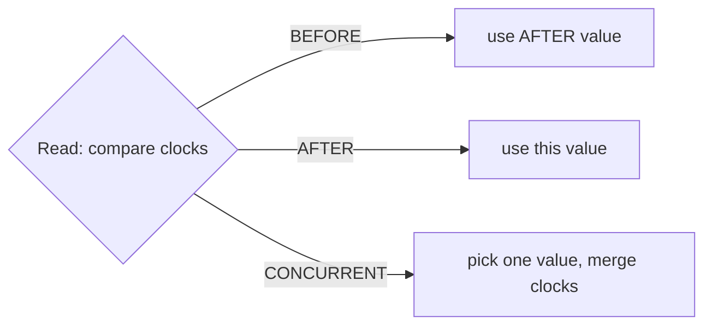
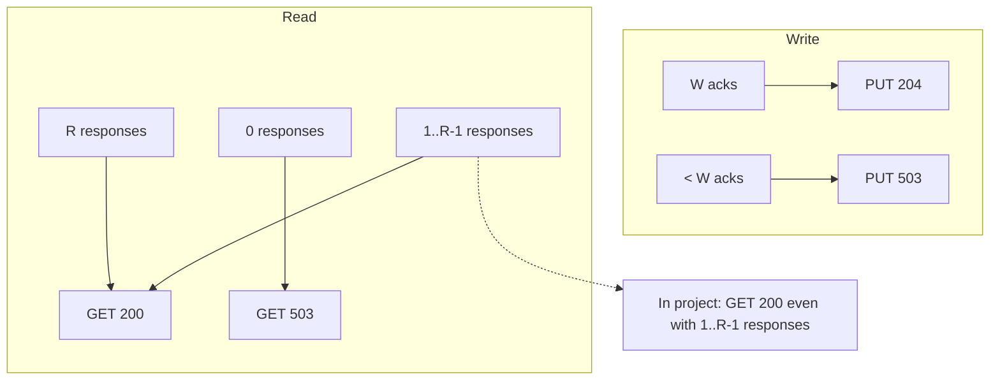
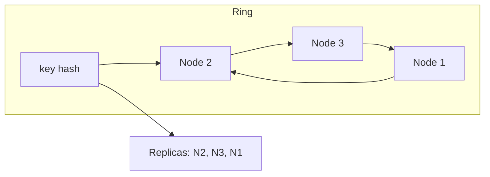
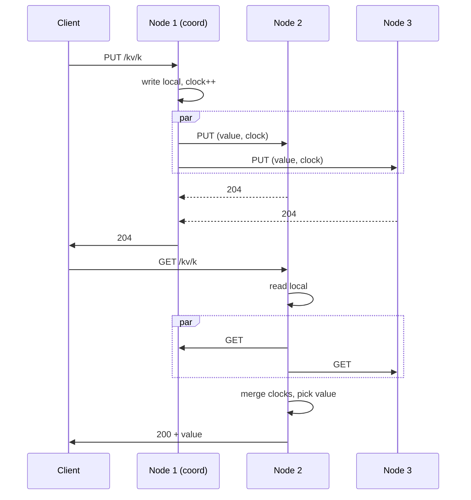
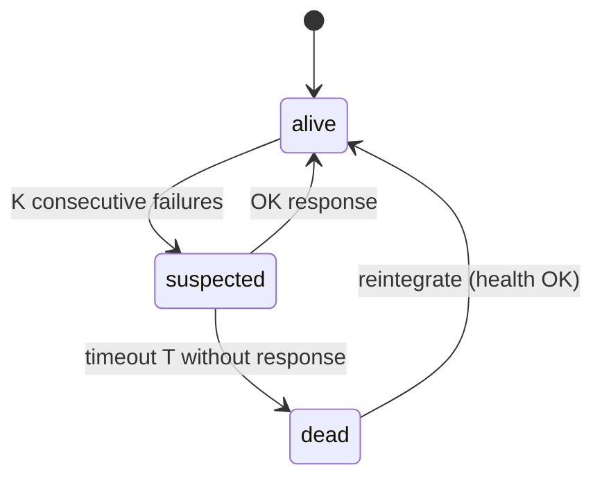

# Distributed KV Store

This document evaluates the distributed KV store project across six areas, describes the decisions made, and presents **alternatives** with implementation details and diagrams for educational use.

## Build and run

The project uses **make**. You need Java 25 and Maven 3.6+. Build with `make build` and `make package`. Start a cluster with `make run` (default 3 nodes) or `make run CLUSTER_SIZE=15`; stop all nodes with `make stop`. To see all targets and examples, run `make help`:

```
Distributed KV Node

Targets:
  build, package, test, verify, clean
  run [CLUSTER_SIZE=3]  start cluster (1..32 nodes)
  run-node NODE=nodei [CLUSTER_SIZE=k]  start node i of k (default k=15)
  stop, stop-node NODE=nodei
  load-test [CLUSTER_SIZE=3]  run then vegeta load test
  flamegraph-deps   install async-profiler + FlameGraph (Homebrew)
  run-flamegraph-node1  start node 1 for profiling
  flamegraph        capture 60s CPU profile -> build/flamegraph.svg
  flamegraph-run    one-shot: run node, load, capture, stop

Examples:
  make run CLUSTER_SIZE=5
  make run-node NODE=node2 CLUSTER_SIZE=5
  make stop-node NODE=node1
  make load-test RATE=100 DURATION=30s
  make load-test CLUSTER_SIZE=15 BASE_URL=http://127.0.0.1:8201
  make flamegraph-deps && make run-flamegraph-node1 && make flamegraph

Overrides (defaults): HOST=127.0.0.1 BASE_PORT=8200 MAX_NODES=32; quorum default min(3, cluster size)
  make run HOST=0.0.0.0 BASE_PORT=8300
  make run CLUSTER_SIZE=7 WRITE_QUORUM=2 READ_QUORUM=2
  make run-node NODE=node2 CLUSTER_SIZE=5 WRITE_QUORUM=2 READ_QUORUM=2
  make wait-node-up URL=http://127.0.0.1:8201/health
```

---

## Quick glossary

| Term | Meaning |
|------|---------|
| **N** | Replication factor: number of replicas per key. |
| **W** | Write quorum: number of replicas that must accept a write for it to be considered successful. |
| **R** | Read quorum: number of replicas consulted on read (or minimum responses to consider the read valid). |
| **Linearizability** | Guarantee that each operation appears to occur at a single instant between its start and end, and that the total order is consistent with real-time order. |
| **Eventual consistency** | Guarantee that, if there are no new writes, all replicas converge to the same state. |
| **Vector clock** | Structure that captures causality between events in distributed systems; allows detection of concurrency (incomparable events). |

---

## 1. System model

The system model is split into: **physical model** (topology, protocol, nodes and links), **architectural model** (components and request path), and **fundamental model** (interaction, failure, security).

### 1.1 Physical model (topology, protocol, nodes and links)

- **Nodes:** KV store instances; each runs an HTTP server, holds local storage, a membership view, and the consistent hash ring.
- **Links:** Client-to-node and node-to-node communication over HTTP (e.g. TCP). No assumption on latency or reliability of the network.
- **Topology:** Clients may send requests to any node. Nodes form a logical ring (consistent hash). Each node sends periodic heartbeats to every other known node (no overlay; no gossip).
- **Protocol:** HTTP: PUT/GET for KV, GET /health for liveness, POST/DELETE /admin/nodes for membership. No custom protocol.

**Tools that implement this:** Dynamo-style systems (leaderless, sync request–response, no time bounds); similar ideas in Amazon Dynamo, Riak, Voldemort.

### 1.2 Architectural model (components and request path)

- **Components:** KvHandler (thread pool), ReplicationClient, MembershipView (ring and alive set), local store, MembershipHeartbeat. Handler runs in a thread pool outside the server's I/O loop; the server uses non-blocking I/O.
- **Request path (PUT):** Request received; write locally; send HTTP PUT to other replicas in parallel (implementation uses `HttpClient.sendAsync` and waits with `join()` for quorum); respond 204 or 503.
- **Request path (GET):** Request received; read local and send GET to other replicas in parallel; merge vector clocks and pick value; respond 200 or 503.
- **Coordination:** Multi-master; the node that receives the request is the coordinator for that request. No single leader.

From the HTTP client's perspective, each request is **synchronous**: the client blocks until response or timeout. Replica calls are parallel internally but the handler waits for quorum before replying.

Current flow diagram (synchronous request; parallel replica calls):

```
+--------+     HTTP      +-------------+   parallel    +----------+
| Client | ------------->| KvHandler   | ------------>| Replicas |
|        |               | (thread     |   PUT/GET    | (N-1)    |
|        |               |  pool)      |              +----------+
|        |               | join() until|
|        | <-------------| quorum      |
|        |   200/503     +-------------+
+--------+
```

Mermaid diagram (PUT sequence):



**Membership (architectural):** View is local at each node; no gossip or consensus. Periodic heartbeats; failure detected after N consecutive failures. See **Section 7** for full implementation and alternatives.

**Tools that implement this:** Same as physical model; this project.

### 1.3 Fundamental model (interaction, failure, security)

- **Interaction model:** No bounds on message delay or clock skew (asynchronous system assumption). From the client's perspective: **synchronous** request–response (one request, block until 200/503 or timeout).
- **Failure model:** Nodes are crash (fail-stop); no Byzantine. Links may drop or delay arbitrarily. Failure detection: heartbeats; after N consecutive failures a node is marked dead. Reintegration when health checks pass again.
- **Security model:** No authentication or authorization; no adversarial nodes; trusted environment.

**Tools that implement this:** Amazon Dynamo, Riak, Voldemort; similar assumptions in Cassandra.

### 1.4 Alternatives (fundamental model: interaction and time)

#### Alternative A: Synchronous model (time bounds)

**Idea:** Assume known bounds on latency and processing time (e.g. every message arrives within Delta; clocks desynchronized by at most Epsilon). Allows using timeouts as a substitute for consensus in some protocols.

**How to implement:**

- Define constants or config `MAX_MESSAGE_DELAY_MS`, `CLOCK_SKEW_MAX_MS`.
- For every communication, use timeout >= MAX_MESSAGE_DELAY_MS.
- For failure detection: mark node as dead after timeout (without N consecutive failures), or use clock to "suspect" nodes that did not respond in time.
- **Trade-off:** In real networks, bounds are hard to guarantee; excessive time causes slowness, too short causes false positives.

**Tools that implement this:** Used in safety-critical and real-time systems; some TLA+ and formal specs assume bounded delay; less common as a named product.

#### Alternative B: Asynchronous request (fire-and-forget / callbacks)

**Idea:** Client does not block waiting for quorum. Sends PUT and gets a fast "ack" (e.g. 202 Accepted with a ticket); then polls status or receives a callback when the write has stabilized.

**How to implement:**

- New endpoint: `POST /kv/async/{key}` returns 202 with `{"requestId": "uuid"}`.
- Backend puts the request in a queue (e.g. in-memory or Redis); worker processes in background (write local + replicate, quorum).
- Endpoint `GET /kv/async/status/{requestId}` returns `pending` or `completed`/`failed`.
- Client polls or uses Server-Sent Events / WebSocket for notification.
- **Trade-off:** Higher complexity and perceived latency to "see" the result; reduces peak load on the server.

**Tools that implement this:** REST APIs with 202 Accepted and job status (e.g. many cloud APIs); message queues (Amazon SQS, RabbitMQ, Kafka) for async processing.

**Decision matrix (system model: interaction and time)**

| Criterion | Implementation | Alt A: Synchronous (time bounds) | Alt B: Async request |
|-----------|-----------------|----------------------------------|----------------------|
| Network assumption | No latency or clock bound | Bounded latency and clock skew (config) | Same as implementation |
| Client blocks until | Response or timeout | Response or timeout | 202 immediately; result via poll/callback |
| PUT round trips (client) | 1 (request until quorum) | 1 | 1 for ack + 0..N for status poll |
| Failure detection basis | N consecutive timeouts | Single timeout (bounded delay) | N/A |
| Extra endpoints | None | None | POST /kv/async/{key}, GET /kv/async/status/{id} |
| Extra stored state per key | None | None | Request queue + status per requestId |

---

## 2. Consistency models (linearizability, eventual)

### 2.1 Project decision

- **Versioning:** Vector clocks per key. Write increments the coordinator node's counter; clocks are sent on PUT and stored.
- **Read:** GET aggregates R (or fewer) responses; merge vector clocks; if one clock is BEFORE another, use the AFTER value; if CONCURRENT, keep one value and merge clocks (no semantic value merge).
- **Consistency:** Eventual with concurrency detection. Not linearizable.

**Tools that implement this:** Amazon Dynamo, Riak, Voldemort; Cassandra with conflict resolution.

Relationship between clocks (conceptual):

```
         AFTER
    v1 -------> v2    (v1 happened-before v2; use v2's value)

    v1 ~~~~~~~ v2     CONCURRENT (merge clocks; pick one value)
         |
         v
    merged_clock
```

Vector clock order (Mermaid):



### 2.2 Alternatives and how to implement

#### Alternative A: Linearizability via leader per key (single leader)

**Idea:** For each key (or partition), a single node is the "leader"; all writes and reads go through the leader or replicas that redirect. The leader serializes operations and propagates in order.

**How to implement:**

- Elect a leader per partition (e.g. first node on the consistent hash for the key, or via consensus such as Raft).
- Client sends PUT/GET to the node it believes is leader (or to any node that redirects with 307 to the leader).
- Leader: for PUT, applies locally in order, then replicates to followers (can be synchronous: wait for W-1 acks before responding to client). For GET, read locally (or read from replicas with R=1 from leader).
- Sequence number or replication log on the leader defines total order; reads on the leader see the last committed write.
- **Trade-off:** Guarantees linearizability; lower availability (leader failure blocks the partition) and higher latency (everything goes through the leader).

**Tools that implement this:** PostgreSQL (single primary), MongoDB (replica set), Redis (primary-replica), etcd, ZooKeeper, Google Spanner, CockroachDB.

Linearizability diagram (single leader):

```
Client A:  PUT(k,v1) --------> Leader -------> Replicas (W)
Client B:  PUT(k,v2) --------> Leader (queued after v1)
Client C:  GET(k) ------------> Leader (returns v2)
            Total order: PUT v1 < PUT v2 < GET
```

#### Alternative B: Last-writer-wins (LWW) with physical timestamp

**Idea:** Drop vector clocks; each write carries a timestamp from the node's (or client's) clock. On conflict, the write with the greater timestamp wins. Typical in eventually consistent systems that prioritize simplicity.

**How to implement:**

- On PUT: send `value` and `timestamp` (millis since epoch, or micros). Store (value, timestamp).
- On GET: query R replicas; for each key, choose the (value, timestamp) pair with the greatest timestamp. Return that value.
- Replication: same PUT (value, timestamp) sent to W replicas; no "increment" per node.
- **Trade-off:** Simple and predictable; poorly synchronized clocks cause undesired overwrites; no detection of "real" concurrency.

**Tools that implement this:** Cassandra (LWW option), Amazon DynamoDB (LWW option), CouchDB.

#### Alternative C: Semantic value merge (CRDTs or application-specific)

**Idea:** Instead of "picking one of the values" on CONCURRENT conflict, apply an application-defined merge (e.g. CRDT such as LWW-Register, OR-Set, or list/counter merge).

**How to implement:**

- If the value is a counter: each replica keeps per-node counters; merge = sum per node; logical value = total sum (CRDT PN-Counter).
- If a set: use OR-Set (elements with tombstones and versioning); merge = union with removal rules.
- In our string KV: could define "merge = concatenation with separator" or "merge = value with greater clock" (LWW). In the current project, the "merge" is only of clocks; the value is one of the existing ones. For true semantic merge, the API would need to expose structure (e.g. JSON) and merge rules per type.
- **Trade-off:** Conflicts resolved without information loss for certain data types; higher complexity and format constraints.

**Tools that implement this:** Riak (CRDTs), Redis (CRDT modules), Automerge, Yjs.

#### Alternative D: Strong read (read-your-writes) without full linearizability

**Idea:** Guarantee that a client that performed a write always sees that write in subsequent reads (even if other reads see a different order). Useful with sticky session or client-id.

**How to implement:**

- Each write returns a "version" or token (e.g. serialized vector clock). Client sends this token on the next GET (header or query).
- Replicas that participated in the write (or the coordinator) keep a "min version" per client-id. GET with client-id only returns value with version >= min version known for that client.
- Alternative: always route the same client to the same node (sticky session); that node applies writes and serves reads in local order.
- **Trade-off:** Improves experience without guaranteeing global order; requires per-client state or affinity.

**Tools that implement this:** DynamoDB (consistent read), session stores, many SQL systems with sticky session or read-from-primary.

#### Alternative E: Global logical clock (Lamport / hybrid)

**Idea:** Introduce a logical "timestamp" (Lamport clock or hybrid logical clock) on each operation, to order events without relying on physical time. Useful for auditing or for last-writer-wins with a defined order.

**How to implement:**

- Each node keeps a Lamport counter `L`. On every event (message send or local event), `L := max(L, L_received) + 1` (or +1 on local event).
- In every replication message, include `lamportTimestamp`. In storage, keep (value, vectorClock, lamportTimestamp).
- For optional "last writer wins": on CONCURRENT conflict by vector clock, break ties by greater Lamport timestamp (or by nodeId if tied).
- **Trade-off:** Does not replace vector clock for causality between replicas; complements it for an optional total order.

**Tools that implement this:** CockroachDB (hybrid logical clock), Spanner-style systems; logical clocks in many research and production systems for ordering.

**Decision matrix (consistency)**

| Criterion | Implementation | Alt A: Single leader | Alt B: LWW timestamp | Alt C: CRDT/merge | Alt D: Read-your-writes | Alt E: Lamport clock |
|-----------|-----------------|----------------------|----------------------|---------------------|--------------------------|------------------------|
| Consistency guarantee | Eventual; concurrency detected | Linearizable | Eventual; no concurrency detection | Eventual; conflict-free merge for supported types | Session: read sees own writes | Eventual; optional total order via Lamport |
| Conflict detection | Vector clock (before/after/concurrent) | None (total order) | None (timestamp or merge) | CRDT merge rules | Version token or client-id | Vector clock; Lamport for tie-break |
| Total order | No | Yes (per partition) | No | No (per type) | No | Optional (per key) |
| Per-key metadata | Vector clock (one counter per node) | Sequence number at leader | Timestamp (single value) | CRDT state (type-dependent) | Vector clock + optional client version | Vector clock + lamportTimestamp |
| Leader required | No | Yes (per partition) | No | No | No (sticky session optional) | No |
| Availability under partition | Any node can accept write | Only leader partition can accept | Any node can accept | Any node can accept | Depends on routing | Any node can accept |

---

## 3. Quorum reads/writes

### 3.1 Project decision

- **Write quorum:** Success if 1 (local) + replicas that responded 204 >= W. Otherwise 503.
- **Read quorum:** 503 only when zero responses. With 1 to R-1 responses, returns aggregated value (clock merge). So R is not strictly enforced when there is any response.

**Tools that implement this:** Dynamo-style KV stores; this project.

Quorum diagram (W=2, R=2, N=3):

```
PUT:  [N1] --+--> write local
             +--> N2 (204)  --> 1+1 >= 2 = OK
             +--> N3 (timeout)

GET:  [N1] --+--> local (v, c1)
             +--> N2 (v, c1)
             +--> N3 (fail)   --> 2 responses; project returns 200 (does not require R=2)
```

Quorum as a function of N, W, R (Mermaid):



### 3.2 Alternatives and how to implement

#### Alternative A: Strict read quorum

**Idea:** GET returns 200 only if at least R replicas respond. If responses < R, return 503.

**How to implement:**

- In `KvHandler.handleGet`: after collecting `results`, check `if (results.size() < config.getReadQuorum()) return HttpResponse.json(503, ...)` before the clock merge. Thus R is always respected when there is a response.
- **Trade-off:** Higher consistency (guarantees R replicas were consulted); lower availability (any failure that leaves fewer than R responses yields 503).

**Tools that implement this:** Cassandra (consistency level QUORUM/ALL), Riak (strict R).

#### Alternative B: Dynamic quorum (sloppy quorum)

**Idea:** Instead of always using the N "natural" replicas from the consistent hash, allow writes and reads to use other nodes when some are unavailable, to increase availability. Typical in Dynamo-style systems.

**How to implement:**

- For PUT: if the first R nodes on the ring for the key include dead nodes, replace with "next" alive nodes on the ring (or random alive nodes). Store hint "was intended for N2 but wrote to N4" for later repair.
- For GET: query R nodes (preferring the N originals, but using others if needed). If reading from a node that is not an "official" replica, may return stale value; an anti-entropy process (e.g. Merkle trees) reconciles later.
- **Trade-off:** Higher availability under failures; hint and reconciliation complexity; possibly staler reads.

**Tools that implement this:** Amazon Dynamo, Cassandra (hinted handoff), Riak.

#### Alternative C: Write path with two-phase commit (2PC) or commit protocol

**Idea:** Guarantee that either all W replicas commit the write, or none. Avoids inconsistent state where some replicas have the write and others do not, after coordinator failure.

**How to implement:**

- Phase 1 (prepare): coordinator sends (key, value, clock) to all W replicas with "prepare". Each replica reserves the value (does not make it visible yet) and responds PREPARED or ABORT.
- Phase 2 (commit): if all W responded PREPARED, coordinator sends COMMIT to all; replicas make the value visible. If any ABORT or timeout, coordinator sends ABORT; replicas discard.
- Blocking: if the coordinator crashes after PREPARED and before COMMIT/ABORT, replicas are in doubt; recovery is needed (new coordinator that asks the participant or assumes abort).
- **Trade-off:** Multi-replica atomicity; higher latency (two rounds) and risk of blocking.

**Tools that implement this:** Traditional XA/2PC (e.g. some RDBMS); Google Spanner, CockroachDB (distributed commit).

2PC diagram (conceptual):

```
Coord    R1      R2      R3
  |--PREPARE-->  |
  |--------PREPARE-->  |
  |----------------PREPARE-->  |
  |<--PREPARED--  |
  |<--------PREPARED--  |
  |<----------------PREPARED--  |
  |--COMMIT-->  |
  |--------COMMIT-->  |
  |----------------COMMIT-->  |
```

#### Alternative D: Read with R responses and requirement of "at least one recent replica"

**Idea:** Besides R responses, require that at least one of them participated in the last write quorum (to improve consistent read in a W+R>N model).

**How to implement:**

- Keep on each replica a "generation" or "epoch" per key (incremented on each successful write in which this replica participated). On GET, ask R replicas; if all return the same version, OK. Otherwise could require that at least one replica has version >= X (where X is obtained by some protocol). Full implementation requires writes to advertise "version" and reads to check overlap with the write set.
- Simpler variant: GET returns 503 if it cannot get R responses with the same vector clock (or with clocks comparable to a "newer" one). This approximates "read that sees at least one copy of the last write quorum".
- **Trade-off:** Improves guarantee of up-to-date read; more complexity and possible extra 503.

**Tools that implement this:** Dynamo-style with quorum read; less often a named feature.

**Decision matrix (quorum)**

| Criterion | Implementation | Alt A: Strict R | Alt B: Sloppy quorum | Alt C: 2PC write | Alt D: R + recent replica |
|-----------|-----------------|-----------------|----------------------|-------------------|---------------------------|
| Write quorum | 1 local + (W-1) acks from ring replicas | Same | All W commit or all abort | Prepare all W then commit all W | Same as implementation |
| Read quorum | Any response count > 0 returns 200 | At least R responses required for 200 | Same as implementation or sloppy | N/A | R responses and at least one from last write quorum |
| GET 503 when | Zero responses | Responses < R | Zero (or < R if strict) | N/A | Zero or no "recent" replica |
| PUT network rounds | 1 (parallel to replicas) | 1 | 2 (prepare, then commit) | 2 | 1 |
| Blocking risk | No | No | Yes (if coordinator fails after prepare) | Yes | No |
| Replica set for key | First N alive on ring | Same | Same | Same | Same |
| Hint / fallback replica | No | No | No | Yes (write to other node if intended down) | No |
| Extra per-key state | None | None | Hint queue for down replicas | Prepare log; recovery protocol | Version/epoch per key |

---

## 4. Consistent hashing

### 4.1 Project decision

- Ring with SHA-256 hash (8 bytes) as ring key; 100 virtual nodes per node; `TreeMap<Long, String>`; successor for key = first node with hash > hash(key), wrap-around.
- Replicas for a key = first R nodes on the ring (no duplicates); then filtered by "alive".

**Tools that implement this:** Amazon Dynamo, Cassandra, Riak, Voldemort, Redis Cluster (hash slots).

Ring diagram (conceptual):

```
        hash space (0 .. 2^64-1)
    ----N1----N2----N3----N1----N2---- ...
         ^         ^
         |         |
    key "x" --> hash(x) --> successor = N2; replicas = N2, N3, N1
```

Ring with virtual nodes (Mermaid):



### 4.2 Alternatives and how to implement

#### Alternative A: Hash mod N (no ring)

**Idea:** key -> hash(key) mod N_nodes. Replicas for key = node(hash mod N), node((hash+1) mod N), ... (R times). Simple, but node removal/addition redistributes many keys.

**How to implement:**

- Ordered list of nodes; `replicaIndex = (hash(key) + i) % nodeCount` for i = 0..R-1. No virtual nodes.
- **Trade-off:** Trivial implementation; when a node leaves or joins, almost all keys change node (heavy rebalancing).

**Tools that implement this:** Simple Memcached-style sharding; basic sharded caches.

#### Alternative B: Rendezvous (highest random weight)

**Idea:** For each (key, node) pair, compute a weight (e.g. hash(key + nodeId)). The replica for key is the node with the greatest weight. Variant: the R nodes with the R greatest weights.

**How to implement:**

- For each known node, compute `weight = hash(key + nodeUrl)` (or consistent hash). Sort nodes by weight descending; take the first R. No ring structure; no virtual nodes.
- **Trade-off:** Node add/remove only affects keys whose node entered/left the top-R; O(nodes) computation per key (can cache by key). Good for smaller clusters.

**Tools that implement this:** Apache Ignite; Ceph (CRUSH variant); some caches.

#### Alternative C: Consistent hashing with "bounded load" or explicit balancing

**Idea:** Virtual nodes help balancing, but imbalance can still occur. Adjust virtual node weights or choose replicas not only by ring order but by current load (e.g. least loaded among ring candidates).

**How to implement:**

- Keep ring as today. When choosing R replicas for key, instead of strictly the first R on the ring, consider the first R*2 and choose R among them by lowest load (e.g. key count per node, or recent latency). Or use "weighted consistent hashing" with weight per node (more virtual nodes for more capable nodes).
- **Trade-off:** Better load balancing; deviation from pure ring order and possibly more key movement when loads change.

**Tools that implement this:** Load balancers with consistent hash and weights (e.g. nginx); weighted consistent hashing in caches.

#### Alternative D: Range-based partitioning (no hash)

**Idea:** Partition by key range (e.g. A-M on N1, N-Z on N2). Replicas = copies of the same range on other nodes. Useful for ordered range scans.

**How to implement:**

- Sort the key space; split into intervals; assign each interval to a "primary" and R-1 "replicas". Lookup by key = binary search in range -> node map. Replicas for key = primary + replicas for that range.
- **Trade-off:** Supports efficient range queries; hotspots if keys are not well distributed; split/merge of ranges when adding/removing nodes.

**Tools that implement this:** HBase, Bigtable, MongoDB (range sharding), CockroachDB, Spanner.

**Decision matrix (consistent hashing)**

| Criterion | Implementation | Alt A: Hash mod N | Alt B: Rendezvous | Alt C: Bounded load | Alt D: Range partition |
|-----------|-----------------|-------------------|-------------------|---------------------|-------------------------|
| Key-to-node mapping | Ring successor (first node with hash > hash(key)) | (hash(key) + i) mod N for i = 0..R-1 | Same as implementation | First R on ring or among 2R by load | Key in range -> primary + replicas |
| Virtual nodes | 100 per node | 0 | 0 or weighted | 0 or weighted | N/A |
| Data structure | TreeMap<Long, String> (ring positions) | Ordered list; modulo | List; sort by weight per key | Ring + load stats | Sorted ranges; binary search |
| Keys moved on 1 node add/remove | O(1/N) of keys (ring) | O(N) in practice (most keys remap) | Only keys whose top-R changed | Variable (load-dependent) | Keys in split/merged ranges only |
| Lookup cost | O(log(ring size)) | O(1) | O(log(ring size)) or O(R*log) | O(log) + load comparison | O(log(range count)) |
| Range scan by key order | No | No | No | No | Yes |
| Rebalancing on topology change | Add/remove points on ring | Full recompute | Ring update; optional weight update | Ring + load update | Split or merge ranges |

---

## 5. Replication strategies

### 5.1 Project decision

- Multi-master: any replica can receive PUT; that node is the coordinator (writes local, propagates in parallel, requires W).
- GET: coordinator queries local + other replicas in parallel; aggregates and merges vector clocks.

**Tools that implement this:** Amazon Dynamo, Riak, Voldemort, Cassandra (multi-datacenter), DynamoDB (global tables).

Current replication diagram:

```
PUT:
  Client --> N1 (coord) --> write local
                |
                +---> N2 (PUT)
                +---> N3 (PUT)
                wait W acks --> 204/503

GET:
  Client --> N2 (coord) --> read local
                |
                +---> N1 (GET)
                +---> N3 (GET)
                merge clocks, pick value --> 200
```

Multi-master replication (Mermaid):



### 5.2 Alternatives and how to implement

#### Alternative A: Primary-secondary (single leader per partition)

**Idea:** One node is primary for each key/partition; writes only to primary; primary propagates to secondaries (synchronous or asynchronous). Reads can be from primary (strong) or any replica (weak).

**How to implement:**

- Elect primary per partition (e.g. first node on consistent hash for the key; election via Raft/Paxos or external service).
- PUT: client sends to primary; primary applies, replicates to secondaries (wait for W-1 acks if strong durability desired); responds 204.
- GET: send to primary for strong read; or to any replica for eventual read (faster, may be stale).
- **Trade-off:** Simplicity of consistency and order; primary is bottleneck and single point of failure until re-election.

**Tools that implement this:** PostgreSQL, MySQL, MongoDB (replica set), Redis (replication), etcd, ZooKeeper.

#### Alternative B: Chain replication

**Idea:** Replicas form a chain (N1 -> N2 -> N3). Writes enter at N1 and propagate along the chain to N3. Reads are served by the last node in the chain (which has all committed writes).

**How to implement:**

- Node order on the ring defines the chain (head = first, tail = last). PUT goes to head; head applies and forwards to next; each node applies and forwards; tail responds to head which responds to client.
- GET goes to tail; tail has the most up-to-date state. Failure: if a node in the middle goes down, reconfigure the chain (e.g. head becomes head of a shorter chain, or elect new tail).
- **Trade-off:** Total order of writes; high write latency (long chain); fault tolerance requires reconfiguration.

**Tools that implement this:** FAWN-KV; chain replication in research and some storage layers.

#### Alternative C: Read repair / hinted handoff

**Idea:** Besides replication on the write path, when doing GET and finding that a replica is stale, send it the correct value (read repair). Or when a node was down during write, store a "hint" and send when it is back (hinted handoff).

**How to implement:**

- On GET: after choosing the "winning" value (clock merge), compare with each response. If replica R returned a value with an older clock, send PUT (value, mergedClock) to R in background (read repair).
- On write path: if replica R failed, store on disk/memory "hint: (key, value, clock) for R". Periodically or when R is back, resend (hinted handoff). Limit hint queue size.
- **Trade-off:** Faster convergence and tolerance to temporary failures; more traffic and complexity.

**Tools that implement this:** Amazon Dynamo, Cassandra, Riak.

#### Alternative D: Background anti-entropy (Merkle trees)

**Idea:** Periodically reconcile replicas that may have diverged (e.g. node that missed writes, or partition). Compare state between replica pairs and exchange differences. Merkle tree allows comparing key ranges without sending all keys.

**How to implement:**

- Each node keeps a Merkle tree over the key set (or per range). Leaves = hash of each key's value; internal nodes = hash of children. Periodically, node A exchanges with node B: root; if different, exchange children hashes; descend to leaves; where they differ, exchange the value (key, value, clock).
- Simpler alternative: send checksum per key range; if different, send key list for the range and then values.
- **Trade-off:** Guarantees eventual convergence even after prolonged failures; CPU and network cost in background.

**Tools that implement this:** Amazon Dynamo, Cassandra, Riak, DynamoDB (global table sync).

**Decision matrix (replication)**

| Criterion | Implementation | Alt A: Primary-secondary | Alt B: Chain replication | Alt C: Read repair / hinted handoff | Alt D: Anti-entropy (Merkle) |
|-----------|-----------------|---------------------------|---------------------------|--------------------------------------|------------------------------|
| Who can accept PUT | Any replica (coordinator) | Head of chain only | Any replica | Same as implementation | Same as implementation |
| Write path | Coordinator writes local; parallel PUT to other replicas | Head applies; forward along chain to tail | Same as implementation; if replica down, store hint | Same as implementation | Same as implementation |
| Read path | Coordinator reads local + parallel GET from others; merge | Tail serves read (has all commits) | Same as implementation; optionally push correct value to stale replica | Same as implementation | Same as implementation |
| Write latency (network) | 1 round (parallel) | R hops along chain | 1 round (+ hint write if down) | 1 round | 1 round |
| Total order of writes | No | Yes (chain order) | No | No | No |
| Background traffic | None | None | Read repair PUTs; hint replay | Merkle tree exchange; value sync | Merkle tree exchange |
| Convergence after partition | When replicas communicate again | After chain reconfig | Read repair + hint delivery | Guaranteed by tree diff + sync | Guaranteed by tree diff |
| Extra stored state | None | Chain position | Hint queue per destination node | Merkle tree per node/range | Merkle tree per node/range |

---

## 6. Simple failure modes

### 6.1 Project decision

- Dead node: heartbeats; N consecutive failures -> marked dead; excluded from `getReplicasFor`.
- Replication timeout: counts as quorum failure; PUT 503 if W not reached; GET may return with fewer than R responses.
- Reintegration: when health checks pass again, node is marked alive.

**Tools that implement this:** Dynamo-style clusters; this project; many custom clusters with heartbeats.

### 6.2 Alternatives and how to implement

#### Alternative A: Failure detection with suspicion (failure detector)

**Idea:** Instead of binary (alive/dead), have a "suspected" state. Suspected nodes may be excluded from leadership but still receive replication so data is not discarded prematurely.

**How to implement:**

- Three states: alive, suspected, dead. Transition alive -> suspected after K failures; suspected -> dead after T more time without response; suspected -> alive if it responds. Replicas for write: alive only. Replicas for read: alive + suspected (optional). Or: suspected nodes do not enter write quorum but enter the replica list for read repair.
- **Trade-off:** Reduces false positives (slow node not treated as dead immediately); more complex decision logic.

**Tools that implement this:** Cassandra (phi accrual), Akka Cluster.

#### Alternative B: Partition handling (avoid split-brain)

**Idea:** Ensure that in case of network partition, at most one partition can accept writes (e.g. quorum requires majority of nodes; in a partition, only the side with majority reaches quorum).

**How to implement:**

- Require W > N/2 (and R > N/2 for strong reads). In any partition, at most one side has majority. Nodes without majority reject writes (503) or redirect to the side they believe is the majority.
- Combine with failure detector: nodes that cannot talk to the majority consider themselves "minority" and refuse writes.
- **Trade-off:** Reduced availability (majority needed); avoids divergence in split-brain.

**Tools that implement this:** etcd, ZooKeeper, Consul, MongoDB (replica set), Cassandra (EACH_QUORUM).

Partition diagram:

```
Partition:  [N1, N2]  |  [N3]
             majority  |  minority
             accept W  |  refuse W (503)
```

Node states (failure detector, Mermaid):



#### Alternative C: Recovery after coordinator failure (write in-flight)

**Idea:** If the node that received the PUT crashes after writing locally and before receiving W acks, other replicas may or may not have received the PUT. On restart, the node should reconcile (e.g. ask other replicas for the key value and align).

**How to implement:**

- On startup, or periodically, each node for each key it holds can GET from other replicas and merge (vector clock); if it finds a greater clock, update locally (or mark "dirty" and request full value). Or run anti-entropy (Merkle) between replicas.
- Write-ahead log: before responding 204, coordinator persists "intent" to disk; on restart, replay unconfirmed intents (resend PUT to replicas).
- **Trade-off:** Consistency after failure; more I/O and recovery protocol.

**Tools that implement this:** PostgreSQL, MongoDB (replication log), Kafka (leader recovery).

#### Alternative D: Checksums and integrity (detect corruption)

**Idea:** Detect data corruption (disk, memory, network) with checksums; do not tolerate Byzantine nodes, but detect silent failures.

**How to implement:**

- When storing (value, clock), also store a checksum (e.g. SHA-256 of payload). On every local read and when receiving from replica, verify checksum; if it fails, drop that replica from the response and mark node as suspected or log.
- In replication, include checksum in body; receivers validate before applying.
- **Trade-off:** Does not solve Byzantine (malicious node can forge checksum); protects against accidental corruption.

**Tools that implement this:** ZFS, PostgreSQL (page checksums), Cassandra (optional), many storage engines.

**Decision matrix (failure modes)**

| Criterion | Implementation | Alt A: Failure detector (suspected) | Alt B: Partition (majority) | Alt C: Coordinator recovery | Alt D: Checksums |
|-----------|-----------------|-------------------------------------|------------------------------|-----------------------------|------------------|
| Node states | Alive, dead | Alive, suspected, dead | Same as implementation | Same as implementation | Same as implementation |
| Transition to dead | N consecutive heartbeat failures | Suspected -> dead after T without response | Same as implementation | Same as implementation | Same as implementation |
| Replica set for write | Alive only | Alive only (suspected excluded) | Alive only | Alive only | Alive only |
| Replica set for read | Alive only | Alive + suspected (optional) | Alive only | Alive only | Alive only; exclude on checksum fail |
| Split-brain prevention | No (both sides can accept writes) | Yes (W > N/2; only majority accepts) | No | No | No |
| Quorum requirement | W, R from config (no majority rule) | W > N/2, R > N/2 for strong read | Same as implementation | Same as implementation | Same as implementation |
| Recovery after coordinator crash | None (in-flight write may be partial) | N/A | WAL replay; resend PUT to replicas; or GET merge on restart | N/A | N/A |
| Corruption detection | No | No | No | No | Yes (checksum per value; reject on mismatch) |
| Blocking risk | No | No | No | Yes (recovery protocol) | No |

---

## 7. Membership management

### 7.1 Project decision

Membership is **local** at each node: there is no gossip or consensus; each node maintains its own view and updates it only via the admin API and its own heartbeat results.

**Data structures:**

- **Known nodes:** Set of node URLs in the consistent hash ring (used for key placement). Initial list from config (`NODES` or default); changes via admin API on the node that receives the request only.
- **Alive set:** Subset of known nodes considered reachable. Only alive nodes are returned by `getReplicasFor(key, r)` and used as replicas for GET/PUT.
- **Self:** The current node URL; excluded from heartbeat targets and used to decide if this node is among the replicas for a key.

**Implementation:**

- **MembershipView** holds the ring, a concurrent set of alive URLs, and a replica cache keyed by (key, r, version). `getReplicasFor(key, r)` takes up to `r` nodes from the ring in order, filtered to alive only; cache is invalidated on any membership or alive-set change.
- **Add node:** `POST /admin/nodes` with body `{"url": "http://host:port"}` adds the URL to the ring and to the alive set. Returns 204 on success, 400 if body is missing or invalid.
- **Remove node:** `DELETE /admin/nodes?url=http://host:port` removes the URL from the ring and from the alive set. Returns 204 on success, 400 if `url` is missing.
- **Failure detection:** **MembershipHeartbeat** runs a scheduled task every `HEARTBEAT_INTERVAL_SECONDS` (default 2). Each round it sends `GET /health` to every other known node (excluding self) with timeout `HEARTBEAT_TIMEOUT_SECONDS` (default 1). On 2xx: failure counter for that node is cleared and the node is marked alive. On timeout or non-2xx: failure counter is incremented; when it reaches `HEARTBEAT_FAILURES_BEFORE_DEAD` (default 3), the node is marked dead. A dead node stays in the ring but is excluded from the alive set until heartbeats succeed again.
- **Observability:** `GET /admin/nodes` returns a JSON array of `{ "url": "...", "alive": true|false }` for all known nodes.

Because admin changes are not propagated, adding or removing a node on one machine does not update others; to have a shared view, every node must be updated (e.g. via admin or config) or a shared discovery mechanism would be required.

**Tools that implement this:** This project; simple clusters with static or admin-configured membership.

Current membership flow (Mermaid):

```mermaid
sequenceDiagram
  participant H as MembershipHeartbeat
  participant V as MembershipView
  participant N2 as Node 2
  participant N3 as Node 3
  loop every HEARTBEAT_INTERVAL_SECONDS
    H->>V: getKnownNodes()
    V-->>H: [N2, N3, ...]
    par
      H->>N2: GET /health
      H->>N3: GET /health
    end
    N2-->>H: 200
    N3-->>H: timeout
    H->>V: markAlive(N2)
    H->>V: recordFailure(N3); after 3: markDead(N3)
  end
```

Direct heartbeat (current) vs single-node view:

```
Current:  N1 ----GET /health----> N2, N3, ...
          N2 ----GET /health----> N1, N3, ...
          (each node keeps its own alive set; no propagation)
```

### 7.2 Alternatives and how to implement

#### Alternative A: Gossip-based membership

**Idea:** Nodes exchange member lists and liveness state with each other so that the view converges in a distributed way without a central coordinator or per-node admin on every machine.

**How to implement:**

- Periodically (e.g. every 2 s), each node sends to a random subset of other nodes a message such as `{ myId, myGeneration, aliveSet, suspectedSet, version }`.
- On receive, merge: update "last time I saw X" or version; if a node has not been seen for K rounds, move to suspected or dead. Use a version or generation to avoid reverting to stale views.
- Variants: SWIM (ping/ack plus indirect ping for suspicion), or pure gossip (each node propagates what it knows). The consistent hash ring would use the merged view (e.g. nodes considered alive by a majority or by this node after merge).
- **Trade-off:** No need to call admin on every node when adding/removing; slower convergence in some cases; temporary divergence between nodes' views; lower load per node than "everyone pings everyone" if gossip fan-out is small.

**Tools that implement this:** Cassandra, Riak, Amazon Dynamo, Consul (SWIM-like), Akka Cluster.

Comparative diagram (direct heartbeat vs gossip):

```
CURRENT PROJECT (direct heartbeat):     GOSSIP (conceptual):
   N1 ----ping----> N2                     N1 <----> N2
   N1 ----ping----> N3                     N2 <----> N3
   N2 ----ping----> N1, N3                 N3 <----> N1
   (each node keeps local list)            (each node propagates partial view)
```

#### Alternative B: Consensus-based membership (Raft, etc.)

**Idea:** Membership changes (add/remove) are proposed and committed through a consensus log so that all participants agree on the same set of members and the same order of changes.

**How to implement:**

- Run Raft (or similar) among the nodes. Configuration changes (add/remove node) are special log entries; the cluster moves to a new configuration only after the entry is committed. Joint consensus or single-step transitions avoid split-brain during reconfiguration.
- Client admin calls one node; that node proposes the config change; once committed, all nodes apply it. Failure detection can remain local (heartbeats) or be tied to Raft's leader heartbeat.
- **Trade-off:** Strong consistency of membership and natural fit with single-leader replication; higher complexity and dependency on the consensus implementation; reconfiguration must be done carefully to avoid loss of quorum.

**Tools that implement this:** etcd, Consul, CockroachDB, TiKV, MongoDB (replica set election).

#### Alternative C: External discovery service (etcd, Consul, Zookeeper)

**Idea:** Membership and liveness are stored in an external distributed store. Nodes register themselves (ephemeral keys) and watch for changes; the KV layer reads the current member list from the store instead of maintaining it locally.

**How to implement:**

- On startup, each node registers itself in the store (e.g. etcd lease, Consul TTL check) and subscribes to the key prefix that lists all nodes. When the list changes, update the local ring and alive set from the store.
- Add/remove can be done via the store's API (or admin API that writes to the store). Failure detection is handled by the store (lease expiry, health checks).
- **Trade-off:** Single source of truth and decoupled failure detection; external dependency and operational cost; need to map store's view (e.g. healthy/unhealthy) to "alive" for getReplicasFor.

**Tools that implement this:** etcd, Consul, ZooKeeper, Kubernetes (API server and Endpoints).

#### Alternative D: Accrual failure detector (suspicion level)

**Idea:** Instead of a fixed threshold (N consecutive failures), use a continuous "suspicion" value (e.g. based on arrival times of heartbeats). Quorum and replica selection can use a threshold on this value (e.g. only nodes with suspicion below 0.5).

**How to implement:**

- Maintain for each node a series of recent heartbeat arrival times (or inter-arrival times). Compute a value (e.g. phi in the Phi Accrual detector) that increases when no heartbeat is received. Mark "alive" when value is below a threshold, "suspected" or "dead" when above.
- Replicas for write: only alive (below threshold). Replicas for read: optionally include suspected to improve availability. Threshold can be tuned to balance detection speed and false positives.
- **Trade-off:** Adapts to network conditions and reduces false positives; more complex than a simple counter and requires parameter tuning.

**Tools that implement this:** Cassandra (phi accrual), Akka Cluster.

**Decision matrix (membership)**

| Criterion | Implementation | Alt A: Gossip | Alt B: Consensus (Raft) | Alt C: External discovery | Alt D: Accrual detector |
|-----------|-----------------|---------------|--------------------------|----------------------------|--------------------------|
| View storage | Local (ring + alive set per node) | Local after merge (gossip state) | Local after config commit (Raft log) | Local copy of store view | Local (ring + suspicion per node) |
| Add/remove node | POST/DELETE /admin/nodes on each node (no propagation) | Gossip merge; no admin to every node | Propose config change; commit in log; all apply | Register/unregister in store; watch updates all | POST/DELETE on each node (same as implementation) |
| Failure detection | GET /health every interval; dead after N consecutive failures | Gossip: dead after K rounds not seen | Raft leader heartbeat; node not in config or not responding excluded | Store TTL/lease; expiry = dead | Phi (or similar) from arrival times; threshold = alive/suspected |
| Propagation of membership | None | Eventual (gossip rounds) | Committed log entry | Store notification to watchers | None |
| External dependency | None | None (in-process Raft) | etcd, Consul, or Zookeeper | etcd, Consul, or Zookeeper | None |
| Heartbeats per node per round | N-1 (one to each other node) | Fan-out to subset (e.g. 1–3 nodes) | None (store does health) | N-1 (same as implementation) | N-1 |
| Detection type | Fixed threshold (N failures) | K rounds (configurable) | TTL/lease (configurable) | TTL/lease | Continuous value (phi); threshold |
| View consistency | Can diverge (each node independent) | Eventually consistent | Store is authority (strong consistency) | Store is authority | Can diverge (local only) |

---

## Summary of decisions and alternatives

| Area | Project decision | Alternatives (summary) |
|------|------------------|------------------------|
| **System model** | Physical: HTTP, ring, all-to-all heartbeats; Architectural: multi-master, thread pool, parallel replica calls, sync request–response; Fundamental: no time bounds, crash failure, no auth | Sync (time bounds); async client (202 + poll). Membership alternatives in Section 7; ordering (Lamport) in Section 2 |
| **Consistency** | Eventual + vector clocks; conflict = merge clocks, one value | Linearizability (single leader); LWW with timestamp; semantic merge (CRDT); read-your-writes; Lamport clock |
| **Quorum** | W strict; R not strict (503 only with 0 responses) | Strict R; sloppy quorum; 2PC on write; R with "recent replica" |
| **Consistent hashing** | SHA-256 ring, 100 vnodes, TreeMap | Hash mod N; rendezvous; bounded load; range-based |
| **Replication** | Multi-master; coord = node that receives; parallel | Primary-secondary; chain replication; read repair / hinted handoff; anti-entropy (Merkle) |
| **Failure modes** | Heartbeat N failures; timeout; reintegration | Failure detector (suspected); partition (majority); in-flight recovery; checksums |
| **Membership** | Local view; admin POST/DELETE /admin/nodes; GET /health heartbeats; N consecutive failures = dead | Gossip; consensus (Raft); external discovery (etcd, Consul); accrual failure detector |

---

## Suggested references

- Lamport, "Time, Clocks, and the Ordering of Events in a Distributed System"
- Dynamo (Amazon): quorum, vector clocks, sloppy quorum, hinted handoff
- Raft / Paxos: consensus for single leader and membership
- SWIM: scalable failure detection and gossip membership
- CRDTs: semantic merge without coordination
- Consistent hashing: Karger et al.; variants (rendezvous, bounded load)
